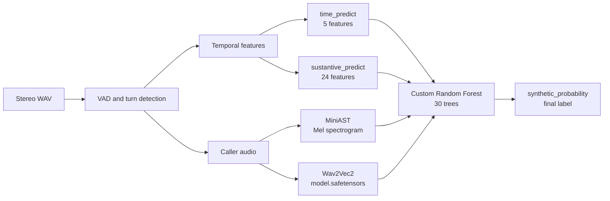

# LFant

## Track Altur | HackMTY 2026

### Equipo Neural Nexus

A banking-call classification system that estimates whether the caller is
**human** or **synthetic**. The project combines conversational signals, such
as response times, turn durations, and overlaps, with acoustic signals extracted
directly from the audio.

The default model is a **stacking Random Forest ensemble**. It does not receive
raw audio as a direct input matrix. Instead, it receives four probabilities
produced by specialized base models and combines them into the final probability
that the caller is synthetic.

## Problem and data

Each call contains two participants:

- **Channel 0:** the caller, who is the person being classified.
- **Channel 1:** the customer-service agent. The agent turns provide context for
  measuring how the caller responds.

The HackMTY dataset contains calls in Mexican Spanish. The labels are:

- `human`: a human caller.
- `synthetic`: a caller generated by an AI system.

The original audio files are stereo WAV, 16-bit PCM, normally sampled at 8 kHz.
The manifest contains the call identifier, label, split, and duration:

```text
anon_id,label,split,duration_s
call_0181ce113ebe,human,train, ...
```

The `train` and `val` splits are caller-disjoint. Local validation uses 282 calls
for training and 71 calls for validation. The real challenge evaluation uses
hidden calls and voices.

The audio and large datasets stay outside the main repository through
`.gitignore`. The data files must be available locally to run the complete
pipeline.

## Overall architecture



The prediction flow is:

1. Receive precomputed turns or decode a stereo WAV.
2. Detect speech segments on each channel when raw audio is received.
3. Compute temporal and call-structure features.
4. Run the two tabular models and the two acoustic models.
5. Pass their four probabilities to the Random Forest.
6. Average the probability produced by the trees and apply a `0.5` threshold.

A probability greater than `0.5` becomes `synthetic`; otherwise, the result is
`human`.

## Turn detection and features

### Detection from audio

`nexus/audio_features.py` converts a complete stereo WAV into turns with this
shape:

```json
{
  "channel": 0,
  "start": 12.4,
  "end": 15.1
}
```

The detector uses:

- 20 ms RMS-energy windows.
- A local noise floor calculated with the 10th percentile in a moving window of
  approximately 3 seconds.
- A speech threshold of 15 times the local noise floor.
- A minimum turn duration of 100 ms.
- Padding for pauses of up to 350 ms so a sentence is not split into too many
  segments.

After turn detection, `extract_channel_audio` concatenates only the channel 0
fragments to feed the acoustic models.

### Temporal features

`nexus/features.py` processes time-ordered turns and merges two segments from
the same channel when their separation is 0.6 seconds or less.

For each call it computes:

- `reaction_*`: statistics of how long the caller takes to respond to the agent.
- `agent_reaction_*`: statistics of how long the agent takes to respond to the
  caller.
- `caller_turn_dur_*`: statistics of caller-turn durations.
- `agent_turn_dur_*`: statistics of agent-turn durations.
- `n_turns_caller`: number of caller turns.
- `n_turns_agent`: number of agent turns.
- `overlap_count`: number of overlaps between participants.
- `overlap_ratio`: proportion of transitions that include an overlap.

Each statistics group contains `mean`, `std`, `min`, `max`, and `median`.

## Specialized base models

The final Random Forest depends on four specialized predictors. Each one observes
a different part of the call and produces a probability of `synthetic`.

### 1. `time_predict`: reaction times

**File:** `nexus/models/time_predict/model.pt`

This model observes only five aggregated features from the caller's reaction
times:

```text
reaction_mean
reaction_std
reaction_min
reaction_max
reaction_median
```

Its goal is to detect differences in conversational latency. A human caller and
a synthetic system can respond with different patterns to the agent's
interventions, even when both produce linguistically correct sentences.

The architecture is a `BinaryMLP` neural network:

```text
5 inputs -> Linear(16) -> ReLU -> Linear(8) -> ReLU -> Linear(1)
```

Inputs are standardized with the mean and standard deviation calculated from
`train` only. The network output is a logit; inference applies sigmoid to obtain
the probability of `synthetic`.

### 2. `sustantive_predict`: call structure

**File:** `nexus/models/sustantive_predict/model.pt`

The name `sustantive_predict` is preserved for code compatibility. This model
uses the 24 features of the complete call:

- 5 caller-reaction statistics.
- 5 agent-reaction statistics.
- 5 caller-turn-duration statistics.
- 5 agent-turn-duration statistics.
- Number of caller turns.
- Number of agent turns.
- Overlap count.
- Overlap ratio.

Its goal is to capture the behavioral structure of the conversation: pace,
pauses, durations, interruptions, and the way turns alternate.

Its architecture is:

```text
24 inputs -> Linear(64) -> ReLU -> Linear(32) -> ReLU -> Linear(1)
```

It also uses standardization based on the training split and produces a
probability through sigmoid.

### 3. MiniAST: acoustic evidence from Mel spectrograms

**File:** `resultados_audio/mini_ast_best.pt`

MiniAST analyzes the acoustic shape of the caller's voice. It does not directly
use turn features. The audio is prepared as follows:

1. Convert to mono.
2. Normalize by peak amplitude.
3. Resample to 16 kHz.
4. Crop or pad to 4 seconds.
5. Compute an STFT with `n_fft=512` and `hop_length=256`.
6. Project to 64 Mel bands between 50 and 8000 Hz.
7. Resize to 128 frames.
8. Provide a tensor with shape `[batch, 1, 64, 128]`.

The `MiniAST` architecture implemented in
`procesamiento_audio_mel_modelos.py` is a small Audio Spectrogram Transformer-
style model:

```text
Mel [1, 64, 128]
  -> Patch Conv2d, embed_dim=64, patch_size=8
  -> 1-layer, 4-head TransformerEncoder
  -> Token average
  -> Linear(64, 2)
```

Its output has two classes, `human` and `synthetic`. The Random Forest keeps
only the probability of the `synthetic` class as `mini_ast_probability`.

### 4. Wav2Vec2: learned acoustic evidence

**Directory:** `wav2vec2_finetuned_model_run/`

This is the fine-tuned Wav2Vec2 model used by the Random Forest. Its main weight
file is:

```text
wav2vec2_finetuned_model_run/model.safetensors
```

The directory also contains `config.json`, processor and tokenizer files,
`vocab.json`, and `training_args.bin`. The code loads everything locally with
`local_files_only=True`, so it does not need to download a checkpoint during
inference.

The audio is resampled to 16 kHz and processed with `Wav2Vec2Processor`. The
network produces logits, softmax is applied, and the `synthetic` label is looked
up in `id2label`. The resulting probability is stored as
`wav2vec_probability`.

Wav2Vec2 and MiniAST are complementary: MiniAST observes a compact Mel
representation of speech segments, while Wav2Vec2 uses a learned waveform
representation to capture broader acoustic patterns.

## Final Random Forest

**Saved model:** `nexus/models/random_forest/model.joblib`

The forest implemented in `nexus/random_forest.py` is a custom implementation,
not `sklearn.ensemble.RandomForestClassifier`. Each tree makes greedy splits
using Gini impurity and is trained on a bootstrap sample.

Its current parameters are:

```text
n_trees = 30
max_depth = 4
min_samples_split = 5
X_features_fraction = 1.0
X_obs_fraction = 1.0
random_state = 42
```

Its four inputs are exactly:

```text
time_predict_probability
sustantive_predict_probability
mini_ast_probability
wav2vec_probability
```

The forest does not analyze the audio again. It takes the four previous outputs,
walks through its trees, and averages the `synthetic` probability produced by
each leaf. That average is `synthetic_probability`.

### Leakage-free stacking

During training, the `time_predict` and `sustantive_predict` probabilities fed
into the forest are not obtained from the same rows used to train and predict
those base models. `train.py` uses five-fold `StratifiedKFold` to generate
out-of-fold predictions on the training split. This prevents the Random Forest
from seeing overly optimistic predictions from the base models.

For validation, the base-model checkpoints trained on the complete training
split are used. The two acoustic probabilities are joined by `anon_id` from
`nexus/acoustic_predictions.csv`.

### Retraining and overfitting controls

The models were retrained to reduce overfitting and keep the validation process
consistent. The workflow applies these controls:

1. Train and validation callers remain disjoint.
2. Feature normalization is fitted on the training split only.
3. The MLPs use early stopping with a configurable patience value.
4. The final forest receives leakage-free out-of-fold base predictions during
   training.
5. Validation uses checkpoints trained on the complete training split rather
   than fitting on validation data.
6. Acoustic predictions are cached by `anon_id` so the same audio/model outputs
   are reused consistently across the pipeline.

Current metrics stored in `nexus/training_metrics.json`:

| Model | Validation AUC | Validation accuracy |
| --- | ---: | ---: |
| `time_predict` | 0.9332 | 0.9155 |
| `sustantive_predict` | 0.9682 | 0.9155 |
| Random Forest | 1.0000 | 1.0000 |

These metrics come from local validation and do not guarantee the same result on
the hidden challenge set.

## Important artifacts

| Path | Purpose |
| --- | --- |
| `nexus/models/random_forest/model.joblib` | Final forest bundle, trees, columns, and base-model paths. |
| `nexus/models/random_forest/normalization.json` | Forest column contract; no additional standardization is applied. |
| `nexus/models/time_predict/model.pt` | MLP using five reaction-time features. |
| `nexus/models/sustantive_predict/model.pt` | MLP using 24 call features. |
| `nexus/models/best_model/model.pt` | Alias for the best tabular validation model. |
| `nexus/models/legacy_model/model.joblib` | Previous pipeline preserved for compatibility. |
| `resultados_audio/mini_ast_best.pt` | MiniAST acoustic model. |
| `wav2vec2_finetuned_model_run/` | Wav2Vec2 processor, tokenizer, and weights. |
| `nexus/models/registry.json` | Model, column, path, and default-model index. |
| `nexus/acoustic_predictions.csv` | Per-call acoustic probability cache. |
| `nexus/training_metrics.json` | Training and validation metrics. |

## Installation

The runtime requires Python and the machine-learning, audio, and API
dependencies. In a new environment, install them with:

```powershell
python -m pip install numpy pandas scipy scikit-learn joblib soundfile torch transformers matplotlib
python -m pip install -r nexus/requirements-endpoint.txt
```

`requirements-endpoint.txt` contains the direct web dependencies: `fastapi` and
`uvicorn`. Installing PyTorch may require a CPU- or CUDA-specific command for
the target machine.

After cloning the repository, retrieve the large Git LFS objects and the
submodule containing the challenge metadata:

```powershell
git lfs install
git lfs pull
git submodule update --init --recursive
```

The training audio is not part of the main repository. Place it in one of these
local paths:

```text
altur-challenge-audio/audio/<anon_id>.wav
datos/channel_0/<human|synthetic>/<anon_id>__ch0.wav
```

## Full training

From the repository root:

```powershell
python nexus/train.py
```

Training follows these stages:

1. Read `nexus/manifest.csv` and each turn JSON file.
2. Build caller-turn rows and aggregate call-level statistics.
3. Calculate the 24 features for the complete call.
4. Run MiniAST and Wav2Vec2 to generate the acoustic cache.
5. Train `time_predict` and `sustantive_predict` with early stopping.
6. Generate the `best_model` alias and preserve the legacy model.
7. Train the Random Forest with five-fold stacking.
8. Update `models/registry.json` and `training_metrics.json`.

Main options:

```powershell
python nexus/train.py --manifest path/manifest.csv --turns-dir path/turns
python nexus/train.py --epochs 300 --patience 40 --seed 42
python nexus/train.py --rf-fold-epochs 120 --torch-learning-rate 0.001
```

The `nexus/acoustic_predictions.csv` cache is reused when it contains every call
in the manifest. If the audio set or manifest changes, delete that CSV before
training again so the acoustic probabilities are recalculated.

## Command-line inference

`nexus/predict.py` selects this model by default:

```text
nexus/models/random_forest/model.joblib
```

It accepts a turn JSON, a turn CSV, a feature CSV, or a `reaction_time` CSV:

```powershell
python nexus/predict.py hackmty26/turns/call_0181ce113ebe.json
python nexus/predict.py nexus/dataset.csv
```

A JSON object can contain `turns`, or the input can be a direct turn list:

```json
{
  "anon_id": "call_demo",
  "turns": [
    {"channel": 1, "start": 0.0, "end": 2.2},
    {"channel": 0, "start": 3.0, "end": 5.1}
  ]
}
```

When predicting from turns without audio, the two acoustic features receive
`0.5` because there is no audio evidence to process. When the identifier can be
resolved to a local WAV, `predict_call` automatically attempts to run the
acoustic detectors.

## HTTP API

Start the server with:

```powershell
python -m uvicorn app:app --app-dir nexus --host 0.0.0.0 --port 8000
```

### `GET /health`

Reports whether the model bundle was loaded at startup:

```json
{"status": "ok", "model_loaded": true}
```

### `POST /predict`

Receives precomputed turns and returns the internal pipeline output:

```json
{
  "turns": [
    {"channel": 1, "start": 0.0, "end": 2.2},
    {"channel": 0, "start": 3.0, "end": 5.1}
  ]
}
```

Response:

```json
{"label": "human", "confidence": 0.18, "n_turns": 1}
```

For this route, `confidence` represents `P(synthetic)`.

### `POST /detect`

This is the challenge contract. It receives the complete WAV encoded in Base64:

```json
{
  "call_id": "call_0181ce113ebe",
  "audio_base64": "<base64-encoded stereo WAV>",
  "sample_rate": 8000,
  "channels": 2
}
```

The endpoint detects turns from the audio, extracts channel 0, runs the acoustic
base models, and finishes with the Random Forest. It responds with:

```json
{"is_synthetic": true, "confidence": 0.87}
```

Here, `confidence` represents certainty in the returned boolean label. If the
prediction is `human`, the server transforms the probability so it still
represents certainty that `is_synthetic=false`.

Under the judge contract, `/detect` attempts to return HTTP 200 even when the
body is invalid, the WAV cannot be decoded, or part of the pipeline fails. In
those cases it returns a fallback based on the synthetic rate in the local
dataset. This prevents an infrastructure error from becoming an invalid HTTP
response, but it does not replace a valid audio input.

To test the endpoint with the challenge client:

```powershell
python hackmty26/scripts/check_endpoint.py `
  --url http://localhost:8000/detect `
  --manifest hackmty26/manifest.csv `
  --audio-dir altur-challenge-audio/audio `
  --split val `
  --n 20
```

If an error says that a WAV file does not exist, the local audio directory is
not available. This is expected after cloning because the audio is excluded
from the repository; download and extract the dataset before running this
test.

## Tests

The main suite validates feature extraction, split integrity, the legacy model,
and prediction:

```powershell
python -m pytest nexus/test_pipeline.py -q
```

It is also recommended to check the endpoint with `check_endpoint.py` when the
audio is available. The challenge limit is 30 seconds per call, and every
response must contain a boolean `is_synthetic`.

## Relevant structure

```text
.
|-- nexus/
|   |-- app.py                         FastAPI API
|   |-- audio_features.py              VAD and channel separation
|   |-- features.py                    turn features
|   |-- predict.py                     inference and model selection
|   |-- random_forest.py               custom forest implementation
|   |-- train.py                       full training
|   |-- torch_models.py                MLPs and checkpoints
|   |-- models/                        models and normalizers
|   |-- manifest.csv                   labels and splits
|   `-- test_pipeline.py               tests
|-- resultados_audio/
|   `-- mini_ast_best.pt               MiniAST
|-- wav2vec2_finetuned_model_run/
|   `-- model.safetensors              active Wav2Vec2 model
|-- hackmty26/                         challenge submodule and scripts
|-- datos/                             ignored local dataset
`-- altur-challenge-audio/audio/       ignored local audio
```

## Limitations and decisions

- The Random Forest depends on the base models and both acoustic models; copying
  only `random_forest/model.joblib` is not sufficient.
- Inference without audio uses `0.5` for both acoustic variables, so it is less
  informative than `/detect` or prediction from a local WAV.
- Validation results are internal and may overestimate performance on new voices.
- Challenge audio must not be redistributed outside the HackMTY 2026 terms of
  use.
- The `decision_tree` node appears in the registry as future work and is not part
  of the current prediction path.

## Contributors

- [@j-ZMC](https://github.com/j-ZMC) - Lead developer of the stacking ensemble
  and final inference pipeline. Implemented the custom Random Forest from
  scratch, without `sklearn`, and added and integrated the two acoustic base
  models that complement the original conversational predictors: MiniAST,
  which classifies caller audio from Mel spectrograms, and fine-tuned Wav2Vec2,
  which learns broader waveform-level acoustic patterns. Retrained the models
  to reduce overfitting through train-only normalization, early stopping,
  caller-disjoint validation, and leakage-free out-of-fold stacking. Also
  reorganized the project information and documented the feature extraction,
  model contracts, inference flow, API, deployment, validation, and retraining
  process. Owned the rest of the repository work outside the two original
  conversational predictors.
- [@jgerr08](https://github.com/jgerr08) - Team recruiter and developer of the
  reaction-time prediction model.
- [@Red-Ninja74](https://github.com/Red-Ninja74) - Team member and contributor to
  `sustantive_predict`, the second conversational binary-prediction model. This
  model focuses on the overall structure of each call, using caller and agent
  reaction statistics, turn durations, turn counts, and overlap patterns to
  distinguish human from synthetic callers.
- [@LuisACastellanosA](https://github.com/LuisACastellanosA) - Team member and
  contributor to `sustantive_predict`, the call-structure prediction model. The
  model complements the reaction-time predictor by learning from the broader
  conversational behavior: pacing, pauses, interruptions, durations, and the
  way the caller and agent alternate turns.
