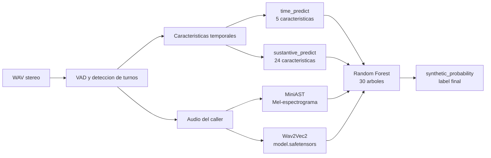

# LFant

## Track Altur | HackMTY 2026

### Equipo Neural Nexus

Sistema de clasificacion de llamadas bancarias que estima si la persona que
habla como caller es **humana** o **sintetica**. El proyecto combina señales de
la conversacion, como tiempos de respuesta, duracion de turnos y solapamientos,
con señales acusticas extraidas directamente del audio.

El modelo que se usa por defecto es un **Random Forest de stacking**. No recibe
el audio crudo como una matriz de entrada directa: recibe cuatro probabilidades
producidas por modelos especializados y las combina para obtener la
probabilidad final de que el caller sea sintetico.

## Problema y datos

Cada llamada contiene dos participantes:

- **Canal 0:** caller, que es la persona que se clasifica.
- **Canal 1:** agente de servicio al cliente. Sus turnos son importantes porque
  sirven de contexto para medir como responde el caller.

El conjunto de datos de HackMTY usa llamadas en espanol mexicano. Las etiquetas
son:

- `human`: caller humano.
- `synthetic`: caller generado por un sistema de IA.

Los audios originales son WAV estereo, PCM de 16 bits y normalmente 8 kHz. El
manifest contiene el identificador de la llamada, su etiqueta, el split y la
duracion:

```text
anon_id,label,split,duration_s
call_0181ce113ebe,human,train, ...
```

Los splits `train` y `val` se mantienen separados por caller. La validacion
local usa 282 llamadas para entrenamiento y 71 para validacion. La evaluacion
real del reto usa llamadas y voces ocultas.

Los audios y bases de datos grandes se mantienen fuera del repositorio principal
mediante `.gitignore`. Para ejecutar el pipeline completo hay que tener los
archivos de datos disponibles localmente.

## Arquitectura general



El flujo de una prediccion es:

1. Recibir turnos ya calculados o decodificar un WAV estereo.
2. Detectar los segmentos de habla de cada canal si se recibe audio crudo.
3. Calcular caracteristicas de tiempo y estructura de la llamada.
4. Ejecutar los dos modelos tabulares y los dos modelos acusticos.
5. Entregar sus cuatro probabilidades al Random Forest.
6. Promediar la probabilidad de los arboles y usar un umbral de `0.5`.

Una probabilidad mayor que `0.5` se convierte en `synthetic`; en caso
contrario, el resultado es `human`.

## Deteccion de turnos y caracteristicas

### Deteccion desde audio

`nexus/audio_features.py` convierte un WAV estereo completo en turnos con la
forma:

```json
{
  "channel": 0,
  "start": 12.4,
  "end": 15.1
}
```

El detector utiliza:

- Ventanas de energia RMS de 20 ms.
- Piso de ruido local, calculado con el percentil 10 en una ventana movil de
  aproximadamente 3 segundos.
- Umbral de voz de 15 veces el piso local.
- Duracion minima de turno de 100 ms.
- Relleno de pausas de hasta 350 ms para no partir una frase en demasiados
  segmentos.

Despues de detectar los turnos, `extract_channel_audio` concatena solamente
los fragmentos del canal 0 para alimentar a los modelos acusticos.

### Caracteristicas temporales

`nexus/features.py` trabaja con turnos ordenados por tiempo y fusiona dos
segmentos del mismo canal si la separacion es de 0.6 segundos o menos.

Para cada llamada calcula:

- `reaction_*`: estadisticas del tiempo que tarda el caller en responder al
  agente.
- `agent_reaction_*`: estadisticas del tiempo que tarda el agente en responder
  al caller.
- `caller_turn_dur_*`: estadisticas de duracion de los turnos del caller.
- `agent_turn_dur_*`: estadisticas de duracion de los turnos del agente.
- `n_turns_caller`: cantidad de turnos del caller.
- `n_turns_agent`: cantidad de turnos del agente.
- `overlap_count`: cantidad de solapamientos entre participantes.
- `overlap_ratio`: proporcion de transiciones con solapamiento.

Cada grupo de estadisticas contiene `mean`, `std`, `min`, `max` y `median`.

## Las sub-IAs

El Random Forest final depende de cuatro predictores especializados. Cada uno
observa una parte diferente de la llamada y produce una probabilidad de
`synthetic`.

### 1. `time_predict`: tiempos de reaccion

**Archivo:** `nexus/models/time_predict/model.pt`

Este modelo observa solamente cinco caracteristicas agregadas de los tiempos
de reaccion del caller:

```text
reaction_mean
reaction_std
reaction_min
reaction_max
reaction_median
```

Su objetivo es detectar diferencias en la latencia conversacional. Un caller
humano y un sistema sintetico pueden responder con patrones diferentes ante las
intervenciones del agente, aunque ambos produzcan frases linguisticamente
correctas.

La arquitectura es una red neuronal `BinaryMLP`:

```text
5 entradas -> Linear(16) -> ReLU -> Linear(8) -> ReLU -> Linear(1)
```

Las entradas se estandarizan usando la media y desviacion calculadas solamente
con `train`. La salida de la red es un logit; durante la inferencia se aplica
sigmoid para obtener la probabilidad de `synthetic`.

### 2. `sustantive_predict`: estructura de la llamada

**Archivo:** `nexus/models/sustantive_predict/model.pt`

El nombre `sustantive_predict` se conserva por compatibilidad con el codigo.
Este modelo usa las 24 caracteristicas de la llamada completa:

- 5 estadisticas de reaccion del caller.
- 5 estadisticas de reaccion del agente.
- 5 estadisticas de duracion de turnos del caller.
- 5 estadisticas de duracion de turnos del agente.
- Cantidad de turnos del caller.
- Cantidad de turnos del agente.
- Conteo de solapamientos.
- Proporcion de solapamientos.

Su objetivo es capturar la estructura conductual de la conversacion: ritmo,
pausas, duraciones, interrupciones y forma de alternar los turnos.

La arquitectura es:

```text
24 entradas -> Linear(64) -> ReLU -> Linear(32) -> ReLU -> Linear(1)
```

Tambien usa estandarizacion basada en el split de entrenamiento y produce una
probabilidad mediante sigmoid.

### 3. MiniAST: evidencia acustica por Mel-espectrograma

**Archivo:** `resultados_audio/mini_ast_best.pt`

MiniAST analiza la forma acustica de la voz del caller. No usa directamente
las caracteristicas de turnos. El audio se prepara asi:

1. Se convierte a mono.
2. Se normaliza por pico.
3. Se remuestrea a 16 kHz.
4. Se recorta o rellena a 4 segundos.
5. Se calcula un STFT con `n_fft=512` y `hop_length=256`.
6. Se proyecta a 64 bandas Mel entre 50 y 8000 Hz.
7. Se redimensiona a 128 frames.
8. Se entrega un tensor con forma `[batch, 1, 64, 128]`.

La arquitectura `MiniAST` implementada en
`procesamiento_audio_mel_modelos.py` es una version pequena de un modelo tipo
Audio Spectrogram Transformer:

```text
Mel [1, 64, 128]
  -> Conv2d de parches, embed_dim=64, patch_size=8
  -> TransformerEncoder de 1 capa y 4 cabezas
  -> promedio de tokens
  -> Linear(64, 2)
```

Su salida tiene dos clases, `human` y `synthetic`. El Random Forest conserva
solamente la probabilidad de la clase `synthetic`, guardada como
`mini_ast_probability`.

### 4. Wav2Vec2: evidencia acustica aprendida

**Directorio:** `wav2vec2_finetuned_model_run/`

Este es el modelo Wav2Vec2 afinado que usa el Random Forest. El peso principal
es:

```text
wav2vec2_finetuned_model_run/model.safetensors
```

La carpeta tambien contiene `config.json`, los archivos del processor y del
tokenizer, `vocab.json` y `training_args.bin`. El codigo carga todo localmente
con `local_files_only=True`; no necesita descargar un checkpoint durante la
inferencia.

El audio se remuestrea a 16 kHz y se procesa con `Wav2Vec2Processor`. La red
genera logits, se aplica softmax y se busca la etiqueta `synthetic` en
`id2label`. La probabilidad resultante se guarda como `wav2vec_probability`.

Wav2Vec2 y MiniAST son complementarios: MiniAST observa una representacion Mel
compacta de segmentos de voz, mientras Wav2Vec2 usa una representacion aprendida
sobre la forma de onda para capturar patrones acusticos mas amplios.

## Random Forest final

**Modelo guardado:** `nexus/models/random_forest/model.joblib`

El bosque implementado en `nexus/random_forest.py` es una implementacion propia,
no `sklearn.ensemble.RandomForestClassifier`. Cada arbol hace divisiones greedy
por impureza Gini y se entrena con una muestra bootstrap.

Sus parametros actuales son:

```text
n_trees = 30
max_depth = 4
min_samples_split = 5
X_features_fraction = 1.0
X_obs_fraction = 1.0
random_state = 42
```

Sus cuatro entradas son exactamente:

```text
time_predict_probability
sustantive_predict_probability
mini_ast_probability
wav2vec_probability
```

El bosque no vuelve a analizar el audio. Toma las cuatro salidas anteriores,
recorre sus arboles y promedia la probabilidad de `synthetic` producida por cada
hoja. Esa media es `synthetic_probability`.

### Stacking sin fuga de informacion

Durante el entrenamiento, las probabilidades de `time_predict` y
`sustantive_predict` que entran al bosque no se obtienen usando la misma fila
para entrenar y predecir. `train.py` usa `StratifiedKFold` con cinco folds para
generar predicciones out-of-fold sobre el split de entrenamiento. Esto evita
que el Random Forest vea predicciones demasiado optimistas de los modelos base.

Para validacion se usan los checkpoints de los modelos base entrenados con el
split de entrenamiento completo. Las dos probabilidades acusticas se unen por
`anon_id` desde `nexus/acoustic_predictions.csv`.

Metricas guardadas actualmente en `nexus/training_metrics.json`:

| Modelo | AUC de validacion | Accuracy de validacion |
| --- | ---: | ---: |
| `time_predict` | 0.9332 | 0.9155 |
| `sustantive_predict` | 0.9682 | 0.9155 |
| Random Forest | 1.0000 | 1.0000 |

Las metricas son de la validacion local. No garantizan el mismo resultado en
el conjunto oculto del reto.

## Artefactos importantes

| Ruta | Funcion |
| --- | --- |
| `nexus/models/random_forest/model.joblib` | Bundle final del bosque, sus arboles, columnas y rutas de modelos base. |
| `nexus/models/random_forest/normalization.json` | Contrato de columnas del bosque; no aplica estandarizacion adicional. |
| `nexus/models/time_predict/model.pt` | MLP de cinco tiempos de reaccion. |
| `nexus/models/sustantive_predict/model.pt` | MLP de 24 caracteristicas de llamada. |
| `nexus/models/best_model/model.pt` | Alias del mejor modelo tabular de validacion. |
| `nexus/models/legacy_model/model.joblib` | Pipeline anterior conservado por compatibilidad. |
| `resultados_audio/mini_ast_best.pt` | Modelo acustico MiniAST. |
| `wav2vec2_finetuned_model_run/` | Processor, tokenizer y pesos Wav2Vec2. |
| `nexus/models/registry.json` | Indice de modelos, columnas, rutas y modelo por defecto. |
| `nexus/acoustic_predictions.csv` | Cache de probabilidades acusticas por llamada. |
| `nexus/training_metrics.json` | Metricas de entrenamiento y validacion. |

## Instalacion

El runtime necesita Python y las dependencias de ML, audio y API. En un
entorno nuevo se pueden instalar con:

```powershell
python -m pip install numpy pandas scipy scikit-learn joblib soundfile torch transformers matplotlib
python -m pip install -r nexus/requirements-endpoint.txt
```

`requirements-endpoint.txt` contiene las dependencias web directas:
`fastapi` y `uvicorn`. La instalacion de PyTorch puede requerir el comando
especifico para CPU o CUDA de acuerdo con el equipo.

Despues de clonar el repositorio, se deben recuperar los objetos grandes de
Git LFS y el submodulo que contiene los metadatos del reto:

```powershell
git lfs install
git lfs pull
git submodule update --init --recursive
```

Los audios de entrenamiento no forman parte del repositorio principal. Deben
colocarse en una de estas rutas locales:

```text
altur-challenge-audio/audio/<anon_id>.wav
datos/channel_0/<human|synthetic>/<anon_id>__ch0.wav
```

## Entrenamiento completo

Desde la raiz del repositorio:

```powershell
python nexus/train.py
```

El entrenamiento sigue estas etapas:

1. Lee `nexus/manifest.csv` y cada JSON de turnos.
2. Construye filas por turno de caller y luego agrega estadisticas por llamada.
3. Calcula las 24 caracteristicas de la llamada completa.
4. Ejecuta MiniAST y Wav2Vec2 para generar el cache acustico.
5. Entrena `time_predict` y `sustantive_predict` con early stopping.
6. Genera el alias `best_model` y conserva el modelo legacy.
7. Entrena el Random Forest con stacking de cinco folds.
8. Actualiza `models/registry.json` y `training_metrics.json`.

Opciones principales:

```powershell
python nexus/train.py --manifest ruta/manifest.csv --turns-dir ruta/turns
python nexus/train.py --epochs 300 --patience 40 --seed 42
python nexus/train.py --rf-fold-epochs 120 --torch-learning-rate 0.001
```

El cache `nexus/acoustic_predictions.csv` se reutiliza cuando contiene todas
las llamadas del manifest. Si se cambia el conjunto de audio o el manifest,
se debe eliminar ese CSV antes de volver a entrenar para recalcular las
probabilidades acusticas.

## Inferencia por linea de comandos

`nexus/predict.py` selecciona por defecto:

```text
nexus/models/random_forest/model.joblib
```

Puede recibir un JSON de turnos, un CSV de turnos, un CSV de caracteristicas o
un CSV de `reaction_time`:

```powershell
python nexus/predict.py hackmty26/turns/call_0181ce113ebe.json
python nexus/predict.py nexus/dataset.csv
```

Un JSON puede tener un objeto con `turns` o una lista directa:

```json
{
  "anon_id": "call_demo",
  "turns": [
    {"channel": 1, "start": 0.0, "end": 2.2},
    {"channel": 0, "start": 3.0, "end": 5.1}
  ]
}
```

Cuando se predice desde turnos sin audio, las dos caracteristicas acusticas
reciben `0.5`, porque no hay evidencia de audio que ejecutar. Cuando el
identificador permite localizar un WAV local, `predict_call` intenta ejecutar
los detectores acusticos automaticamente.

## API HTTP

El servidor se inicia asi:

```powershell
python -m uvicorn app:app --app-dir nexus --host 0.0.0.0 --port 8000
```

### `GET /health`

Indica si el bundle del modelo se cargo al arrancar:

```json
{"status": "ok", "model_loaded": true}
```

### `POST /predict`

Recibe turnos ya calculados y devuelve la salida interna del pipeline:

```json
{
  "turns": [
    {"channel": 1, "start": 0.0, "end": 2.2},
    {"channel": 0, "start": 3.0, "end": 5.1}
  ]
}
```

Respuesta:

```json
{"label": "human", "confidence": 0.18, "n_turns": 1}
```

En esta ruta, `confidence` representa `P(synthetic)`.

### `POST /detect`

Es el contrato del reto. Recibe el WAV completo codificado en Base64:

```json
{
  "call_id": "call_0181ce113ebe",
  "audio_base64": "<base64 del WAV estereo>",
  "sample_rate": 8000,
  "channels": 2
}
```

El endpoint detecta los turnos desde el audio, extrae el canal 0, ejecuta las
sub-IAs acusticas y termina en el Random Forest. Responde:

```json
{"is_synthetic": true, "confidence": 0.87}
```

Aqui `confidence` representa la certeza de la etiqueta booleana devuelta. Si la
prediccion es `human`, el servidor transforma la probabilidad para que siga
representando la certeza de `is_synthetic=false`.

Por el contrato del juez, `/detect` intenta devolver HTTP 200 incluso cuando el
body es invalido, el WAV no se puede decodificar o falla una parte del pipeline.
En esos casos devuelve un fallback basado en la tasa de sinteticos del conjunto
local. Esto evita convertir un error de infraestructura en una respuesta HTTP
no valida, aunque no sustituye tener un audio correcto.

Para probar el endpoint con el cliente del reto:

```powershell
python hackmty26/scripts/check_endpoint.py `
  --url http://localhost:8000/detect `
  --manifest hackmty26/manifest.csv `
  --audio-dir altur-challenge-audio/audio `
  --split val `
  --n 20
```

Si aparece un error porque no existe un WAV, el directorio de audio no esta
disponible localmente. Es esperado que no aparezca despues de clonar, porque
los audios estan excluidos del repositorio; hay que descargar y descomprimir el
dataset antes de ejecutar esta prueba.

## Pruebas

La suite principal valida la extraccion de caracteristicas, la integridad de
los splits, el modelo legacy y la prediccion:

```powershell
python -m pytest nexus/test_pipeline.py -q
```

Tambien se recomienda revisar el endpoint con `check_endpoint.py` cuando se
dispone del audio. El limite del reto es de 30 segundos por llamada y la
respuesta debe contener siempre un booleano `is_synthetic`.

## Estructura relevante

```text
.
|-- nexus/
|   |-- app.py                         API FastAPI
|   |-- audio_features.py              VAD y separacion de canales
|   |-- features.py                    caracteristicas de turnos
|   |-- predict.py                     inferencia y seleccion de modelos
|   |-- random_forest.py               implementacion del bosque
|   |-- train.py                       entrenamiento completo
|   |-- torch_models.py                MLPs y checkpoints
|   |-- models/                        modelos y normalizadores
|   |-- manifest.csv                   etiquetas y splits
|   `-- test_pipeline.py               pruebas
|-- resultados_audio/
|   `-- mini_ast_best.pt               MiniAST
|-- wav2vec2_finetuned_model_run/
|   `-- model.safetensors              Wav2Vec2 activo
|-- hackmty26/                         submodulo y scripts del reto
|-- datos/                             dataset local, ignorado
`-- altur-challenge-audio/audio/       audios locales, ignorados
```

## Limitaciones y decisiones

- El Random Forest depende de que existan los modelos base y los dos modelos
  acusticos; no es suficiente copiar solamente `random_forest/model.joblib`.
- La inferencia sin audio usa `0.5` para las dos variables acusticas, por lo
  que es menos informativa que `/detect` o una prediccion con WAV local.
- Los resultados de validacion son internos y pueden sobreestimar el rendimiento
  en voces nuevas.
- No se deben redistribuir los audios del reto fuera de las condiciones de uso
  de HackMTY 2026.
- El nodo `decision_tree` aparece en el registro como trabajo futuro; no forma
  parte de la prediccion actual.

## Equipo
- [@jgerr08](https://github.com/jgerr08) - [Reclutador del equipo y desarrollador del modelo de predicción de tiempo de reacción.]
- [@j-ZMC](https://github.com/j-ZMC) — [su rol]
- [@Red-Ninja74](https://github.com/Red-Ninja74) — [su rol]
- [@LuisACastellanosA](https://github.com/LuisACastellanosA) — [su rol]
